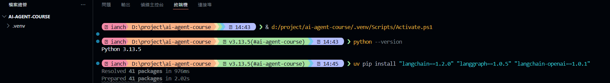

# Python 開發環境準備指引
## AI Agent 開發課程前置作業

---

## 課程說明

在正式進入 AI Agent 開發之前，我們需要先把 Python 開發環境準備好。這份指引會帶您了解：

1. **為什麼需要 Python 虛擬環境?**
2. **如何使用 uv 建立虛擬環境?**

---

## 為什麼需要 Python 虛擬環境 (Virtual Environment)?

### 情境說明

想像一下這個場景:

**小葵的困擾:**
- 上週開發專案A,安裝了 LangChain 0.1.0 + python3.11
- 這週開發專案B,需要 LangChain 0.2.0 (有新功能) + python3.11
- 結果專案A跑不動了! 

這就像是:
> 你家只有一個客廳，但今天要同時辦婚禮和喪禮...這根本不可能!
> 因為二個專案需要不同的「環境」，一旦依賴全域環境，就會產生衝突，所以需要虛擬環境來解決這個問題。
> 這也是為什麼專業的 Python 開發者都會使用虛擬環境來管理專案。
> 把虛擬環境想像成「每個專案一個獨立的小房間」，房間裡的套件版本互不影響。

### 三大核心理由

**先說結論: 虛擬環境是專業開發者的必備技能，不是選配，是標配!**

#### 1. **套件版本隔離 (Package Isolation)**

不同專案依賴不同版本套件，不會互相打架。

```
全域環境 (不好的做法)
├── Python 3.11
└── 所有專案共用同一套套件
    ├── langchain==0.1.0  ⚠️ 只能存在一個版本
    ├── langchain==0.2.0  ❌ 衝突!
    └── ...

虛擬環境 (正確做法)
├── 專案A環境/
│   └── langchain==0.1.0  ✅
├── 專案B環境/
│   └── langchain==0.2.0  ✅
└── 專案C環境/
    └── langchain==0.3.0  ✅
```

#### 2. **保持系統乾淨 (System Cleanliness)**

- **不污染系統 Python**: 您的作業系統本身也在使用 Python，如果隨意安裝套件可能會影響系統運作，避免把套件亂裝到系統 Python，久了很難維護。
- **方便移除**: 不想要某個專案了?直接刪除該虛擬環境資料夾即可，不會留下殘留檔案
- **好清理、好重建**：環境壞了，刪掉 `.venv` 重新建立最快。

#### 3. **專案可重現性 (Reproducibility)**

```bash
# 團隊協作時
開發者A: "我這邊可以跑啊,為什麼你那邊不行?"
開發者B: "因為我的套件版本跟你不一樣..."

# 有了虛擬環境 + 套件清單
✅ 確保每個人用的套件版本完全相同
✅ 新同事加入，10分鐘就能把環境建起來
✅ 三個月後回來維護，環境一模一樣
```

---

## 為什麼選擇 uv?

`uv` 是一套速度很快的 Python 工具，可以用來：
- 建立虛擬環境：`uv venv`
- 安裝套件：`uv pip install ...`
- （選用）安裝/管理 Python：`uv python install ...`

### 傳統工具 vs uv

| 特性     | venv/virtualenv | conda      | **uv**                |
| -------- | --------------- | ---------- | --------------------- |
| 速度     | 普通            | 慢         | **⚡ 超快 (10-100倍)** |
| 安裝套件 | pip (慢)        | conda (慢) | **內建 (極快)**       |
| 磁碟空間 | 大              | 很大       | **小**                |
| 學習曲線 | 簡單            | 複雜       | **簡單**              |
| 現代化   | ⚠️ 老舊          | ⚠️ 老舊     | **✅ 2024最新**        |

### uv 的優勢

1. **快到飛起來**: 用 Rust 開發，速度是傳統工具的 10-100 倍
2. **一個工具搞定**: 管理 Python 版本 + 虛擬環境 + 套件安裝
3. **與 pip 相容**: 可以無痛轉換，不用重新學習
4. **業界趨勢**: 越來越多公司採用，連 anthropic 都在用!

> **我的建議**: 在 2024 年學 Python，直接從 uv 開始就對了!

---

## 💻 uv 安裝與使用教學

### Step 1: 安裝 uv

#### Windows

```powershell
# 使用 PowerShell 執行
powershell -ExecutionPolicy ByPass -c "irm https://astral.sh/uv/install.ps1 | iex"
```

#### macOS / Linux

```bash
# 使用終端機執行
curl -LsSf https://astral.sh/uv/install.sh | sh
```

#### 驗證安裝

```bash
# 確認安裝成功
uv --version

# 應該會看到類似輸出
# uv 0.9.18 (0cee76417 2025-12-16)
```

---

### Step 2: 建立專案虛擬環境

#### 📁 建立專案資料夾

```bash
# 建立課程專案資料夾
mkdir ai-agent-course
cd ai-agent-course
```


#### 🔧 初始化虛擬環境

```bash
# 使用 uv 建立虛擬環境
uv venv

# 會看到輸出
# Using CPython 3.13.5 interpreter at: C:\Python313\python.exe
# Creating virtual environment at: .venv
# Activate with: .venv\Scripts\activate
```
如果你的電腦沒有該版本 Python，可先安裝：

```bash
# 建立課程專案資料夾
uv python install 3.13
```

**發生了什麼事?**
- uv 在專案資料夾內建立了一個 `.venv` 資料夾
- 這個資料夾就是我們的「獨立小天地」
- 所有套件都會裝在這裡面，不會影響其他專案

---

### Step 3: 啟用虛擬環境

#### Windows (PowerShell)

```powershell
# 啟用虛擬環境
.venv\Scripts\Activate.ps1

# 成功後會看到提示符號前面多了 (.venv)
# (.venv) PS C:\Users\YourName\ai-agent-course>
```

**重要注意事項**
PowerShell 執行策略問題：如果你在 PowerShell 中執行 .venv\Scripts\Activate.ps1 時收到安全錯誤，需要先設定執行策略：

```powershell
Set-ExecutionPolicy -ExecutionPolicy Bypass -Scope CurrentUser

```

#### macOS / Linux

```bash
# 啟用虛擬環境
source .venv/bin/activate

# 成功後會看到提示符號前面多了 (.venv)
# (.venv) user@mac ai-agent-course %
```

---

### Step 4: 安裝 AI Agent 開發套件

**課程以 VS Code 為主要開發工具，請確保您已安裝好 VS Code 並開啟本專案資料夾。**

用 VS Code 打開「專案資料夾」（包含 .venv 那層），接著開啟整合終端機 (Terminal)，然後執行以下指令安裝必要套件:

```bash
# 確保虛擬環境已啟用 (前面有 .venv)

# 使用 uv pip 安裝套件 (超快!)
uv pip install "langchain==1.2.0" "langgraph==1.0.5" "langchain-openai==1.0.1" "python-dotenv==1.2.1"

```



---

### Step 5: 儲存套件清單

```bash
# 匯出目前安裝的所有套件
uv pip freeze > requirements.txt

```

確認專案目錄內會多一個 `requirements.txt` 檔案，查看 `requirements.txt` 內容，應該會看到類似以下內容：

**`requirements.txt` 範例:**
```
langchain==0.1.0
langchain-openai==0.0.5
langgraph==0.0.20
python-dotenv==1.0.0
jupyter==1.0.0
...
```

**`requirements.txt` 用途:**
- 📤 分享給團隊成員
- 📥 在其他電腦上重建相同環境
- 🔄 確保開發/測試/正式環境一致

---

## 🎯 常用操作速查表

### 虛擬環境管理

```bash
# 建立虛擬環境
uv venv

# 指定 Python 版本
uv venv --python 3.11
uv venv --python 3.12

# 刪除虛擬環境 (直接刪資料夾即可)
rm -rf .venv          # macOS/Linux
Remove-Item .venv -Recurse  # Windows PowerShell
```

### 套件管理

```bash
# 安裝套件
uv pip install <套件名稱>
uv pip install langchain

# 安裝特定版本
uv pip install langchain==0.1.0

# 從 requirements.txt 安裝
uv pip install -r requirements.txt

# 更新套件
uv pip install --upgrade langchain

# 解除安裝
uv pip uninstall langchain

# 列出已安裝套件
uv pip list

# 查看套件資訊
uv pip show langchain
```

### 啟用/停用環境

```bash
# 啟用
source .venv/bin/activate        # macOS/Linux
.venv\Scripts\Activate.ps1       # Windows

# 停用
deactivate
```

---

## 🏗️ 課前檢查清單

請完成以下步驟,確保您的環境設定正確:

### ✅ 檢查清單

```bash
# 1. 確認 uv 已安裝
uv --version

# 2. 建立課程專案資料夾
mkdir ai-agent-course
cd ai-agent-course

# 3. 建立虛擬環境
uv venv

# 4. 啟用虛擬環境
source .venv/bin/activate   # 或 Windows 對應指令

# 5. 安裝基本套件
uv pip install "langchain==1.2.0" "langgraph==1.0.5" "langchain-openai==1.0.1" "python-dotenv==1.2.1"

# 6. 儲存套件清單
uv pip freeze > requirements.txt

# 7. 確認檔案存在
ls requirements.txt  # macOS/Linux
dir requirements.txt # Windows
```

---

## 🔧 常見問題排除

### Q1: PowerShell 顯示「無法載入」錯誤

```powershell
# 錯誤訊息: 無法載入，因為這個系統上已停用指令碼執行

# 解決方法: 以系統管理員身份執行 PowerShell
Set-ExecutionPolicy -ExecutionPolicy RemoteSigned -Scope CurrentUser
```

### Q2: 找不到 Python

```bash
# 確認 Python 已安裝
python --version
# 或
python3 --version

# 如果沒有,請先安裝 Python 3.11+
# Windows: https://python.org
# macOS: brew install python
# Linux: sudo apt install python3
```

### Q3: uv pip install 很慢

```bash
# 可能的原因:
# 1. 網路連線問題
# 2. 防火牆阻擋
# 3. uv 版本過舊，請更新 uv

```

### Q4: 忘記啟用虛擬環境

```bash
# 症狀: 安裝套件後 import 失敗
# 檢查: 命令列前面有沒有 (.venv)?

# 解決: 重新啟用
source .venv/bin/activate  # macOS/Linux
.venv\Scripts\Activate.ps1 # Windows
```

---

## 📚 推薦觀念
- **虛擬環境最佳實務**: 一個專案一個虛擬環境
- **gitignore 設定**: 記得將 `.venv/` 加入 `.gitignore`
- **命名慣例**: 使用 `.venv` 或 `venv` 作為資料夾名稱

---

## 🎓 總結

準備好了嗎? 讓我們回顧一下重點:

### 核心概念
✅ **虛擬環境** = 專案獨立的「小宇宙」  
✅ **隔離套件** = 避免版本衝突  
✅ **可重現** = 團隊協作、環境一致  

### 實作步驟
1️⃣ 安裝 uv  
2️⃣ `uv venv` 建立環境  
3️⃣ `activate` 啟用環境 ，離開環境用 `deactivate`
4️⃣ `uv pip install` 安裝套件  
5️⃣ `freeze` 儲存清單  

### 給學員的話

> 環境設定可能有點枯燥，但這是開發的基礎功。就像蓋房子要先打地基一樣，把環境搞定了，後面學習 LangChain 和 LangGraph 才會順利!

> 如果遇到問題，不要擔心，**這很正常**! 課程開始時我們會一起檢查環境，確保每個人都能順利跟上。

**記住: 沒有笨問題，只有不問的問題!**

期待在課堂上見到大家! 🚀
---

*最後更新: 2025年12/26  
*講師: [Ian Chen] | AI應用開發講師*